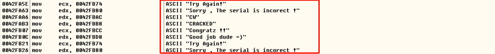
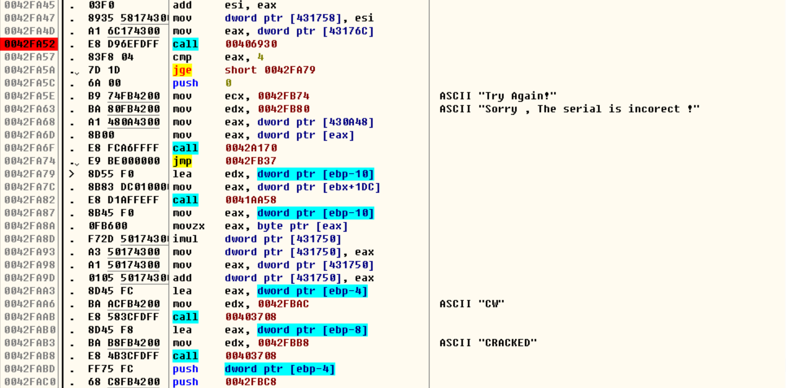

## Acid burn

### 0x00 程序运行

运行程序，发现程序主要有两个功能：`Serial / Name` 和 `Serial` 


`OD` 查找所有参考文本字符串, 根据以下的字符串定位到主要功能：



提取主要的汇编代码：




### 0x01 分析功能

- **参数存储**

  首先, 分析 `Serial / Name `  **参数存储**：

  ```
  0042F9B5  |.  C705 50174300>mov     dword ptr [431750], 29
  0042F9BF  |.  8D55 F0       lea     edx, dword ptr [ebp-10]
  0042F9C2  |.  8B83 DC010000 mov     eax, dword ptr [ebx+1DC]
  0042F9C8  |.  E8 8BB0FEFF   call    0041AA58
  0042F9CD  |.  8B45 F0       mov     eax, dword ptr [ebp-10]
  0042F9D0  |.  E8 DB40FDFF   call    00403AB0
  0042F9D5  |.  A3 6C174300   mov     dword ptr [43176C], eax
  0042F9DA  |.  8D55 F0       lea     edx, dword ptr [ebp-10]
  0042F9DD  |.  8B83 DC010000 mov     eax, dword ptr [ebx+1DC]
  0042F9E3  |.  E8 70B0FEFF   call    0041AA58
  0042F9E8  |.  8B45 F0       mov     eax, dword ptr [ebp-10]
  0042F9EB  |.  0FB600        movzx   eax, byte ptr [eax]
  0042F9EE  |.  8BF0          mov     esi, eax
  0042F9F0  |.  C1E6 03       shl     esi, 3
  0042F9F3  |.  2BF0          sub     esi, eax
  0042F9F5  |.  8D55 EC       lea     edx, dword ptr [ebp-14]
  0042F9F8  |.  8B83 DC010000 mov     eax, dword ptr [ebx+1DC]
  0042F9FE  |.  E8 55B0FEFF   call    0041AA58
  0042FA03  |.  8B45 EC       mov     eax, dword ptr [ebp-14]
  0042FA06  |.  0FB640 01     movzx   eax, byte ptr [eax+1]
  0042FA0A  |.  C1E0 04       shl     eax, 4
  0042FA0D  |.  03F0          add     esi, eax
  0042FA0F  |.  8935 54174300 mov     dword ptr [431754], esi
  0042FA15  |.  8D55 F0       lea     edx, dword ptr [ebp-10]
  0042FA18  |.  8B83 DC010000 mov     eax, dword ptr [ebx+1DC]
  0042FA1E  |.  E8 35B0FEFF   call    0041AA58
  0042FA23  |.  8B45 F0       mov     eax, dword ptr [ebp-10]
  0042FA26  |.  0FB640 03     movzx   eax, byte ptr [eax+3]
  0042FA2A  |.  6BF0 0B       imul    esi, eax, 0B
  0042FA2D  |.  8D55 EC       lea     edx, dword ptr [ebp-14]
  0042FA30  |.  8B83 DC010000 mov     eax, dword ptr [ebx+1DC]
  0042FA36  |.  E8 1DB0FEFF   call    0041AA58
  0042FA3B  |.  8B45 EC       mov     eax, dword ptr [ebp-14]
  0042FA3E  |.  0FB640 02     movzx   eax, byte ptr [eax+2]
  0042FA42  |.  6BC0 0E       imul    eax, eax, 0E
  0042FA45  |.  03F0          add     esi, eax
  0042FA47  |.  8935 58174300 mov     dword ptr [431758], esi
  ```

  翻译成伪代码并添加注释：

  ```assembly
  ; 将 0x29 存放到地址 0x00431750 处
  0x29 => dword ptr [431750]
  
  ; 将 serial 的第 1,2 个字符进行线性组合并存储到 0x00431754
  esi = eax = ascii( serial[0] )
  esi = ascii( serial[0]) < 3
  esi = esi - eax = 7 * ascii( serial[0] )
  eax = ascii( serial[1] )
  eax = ascii( serial[1] ) < 4
  esi = esi + eax = 7 * ascii( serial[0] ) + 16 * ascii( serial[1] )
  esi => dword ptr [431754]
  
  ; 将 serial 的第 3,4 个字符进行线性组合并存储到 0x00431758
  eax = ascii( serial[3] )
  esi = 11 *  eax = 11 * ascii( serial[3] )
  eax = ascii( byte[2] )
  esi = esi + 14 *  eax = 11 * ascii(byte[3] ) + 14 * ascii( byte[2] )
  esi => dword ptr [431758]
  ```

- **长度判断**

  接着以上的汇编代码，然后是 **长度判断** 功能：

    ```assembly
    0042FA4D  |.  A1 6C174300   mov     eax, dword ptr [43176C]
    0042FA52  |.  E8 D96EFDFF   call    00406930
    0042FA57  |.  83F8 04       cmp     eax, 4
    0042FA5A  |.  7D 1D         jge     short 0042FA79
    ```

    `0x0043176C` 是输入的 `Serial` 字符串的首地址, 接下来是 `call 00406930` 的内容：

    ```assembly
    00406930  /$  89FA          mov     edx, edi
    00406932  |.  89C7          mov     edi, eax
    00406934  |.  B9 FFFFFFFF   mov     ecx, -1
    00406939  |.  30C0          xor     al, al
    0040693B  |.  F2:AE         repne   scas byte ptr es:[edi]
    0040693D  |.  B8 FEFFFFFF   mov     eax, -2
    00406942  |.  29C8          sub     eax, ecx
    00406944  |.  89D7          mov     edi, edx
    00406946  \.  C3            retn
    ```

    `mov ecx,-1` 使 `ecx` 的值为 `0xffffffff` , `xor al,al` 使 `eax` 的值为 0 , `scas byte ptr es:[edi]` 是将 `al `  与 `byte ptr es:[edi]` 进行比较, 如果相同则将 ZF = 1 。`repne` 重复比较，如果没有达到终止条件 ( `ZF` = 1 或 `ecx` = 0)，则将 `edi + size(byte/word/dword ...)` 同时 `ecx -= 1`。举个例子：如果我们输入 `1234` , `edi` 需要比较 4 次才能够取 0 , 这时 `ZF` = 1 , 达到终止条件 。如果按照以上的指令继续执行:

    ```
    mov      eax, -2						; eax = 0xfffffffe,ecx = 0xfffffffa
    sub		eax,ecx						    ; eax = 4 
    ```

    最后的返回值 `exa = 4` ( 返回了输入的 `serial` 的长度 )。接下来的汇编判断了返回值是否大于 4。i.e. 以上的函数实现了得到字符串长度的功能，从而了限制字符串的长度至少为 4 。


- **进制转化**

    ```
    0042FA87  |.  8B45 F0       mov     eax, dword ptr [ebp-10]
    0042FA8A  |.  0FB600        movzx   eax, byte ptr [eax]
    0042FA8D  |.  F72D 50174300 imul    dword ptr [431750]
    0042FA93  |.  A3 50174300   mov     dword ptr [431750], eax
    0042FA98  |.  A1 50174300   mov     eax, dword ptr [431750]
    0042FA9D  |.  0105 50174300 add     dword ptr [431750], eax
    0042FAA3  |.  8D45 FC       lea     eax, dword ptr [ebp-4]
    0042FAA6  |.  BA ACFB4200   mov     edx, 0042FBAC                    ;  ASCII "CW"
    0042FAAB  |.  E8 583CFDFF   call    00403708
    0042FAB0  |.  8D45 F8       lea     eax, dword ptr [ebp-8]
    0042FAB3  |.  BA B8FB4200   mov     edx, 0042FBB8                    ;  ASCII "CRACKED"
    0042FAB8  |.  E8 4B3CFDFF   call    00403708
    0042FABD  |.  FF75 FC       push    dword ptr [ebp-4]
    0042FAC0  |.  68 C8FB4200   push    0042FBC8
    0042FAC5  |.  8D55 E8       lea     edx, dword ptr [ebp-18]
    0042FAC8  |.  A1 50174300   mov     eax, dword ptr [431750]
    0042FACD  |.  E8 466CFDFF   call    00406718
    ```

    主要逻辑 ：取 Serial 的第一个字符的 ascii 乘 ( 0x29 * 2 )  作为 `dword `, 转化为十进制字符串 , 连接为 `CW-XXXX-CRACKED `, 这里的字符串就是最后的 `Name`。


- **字符串比较**函数 (0x4039fc)：

    ```assembly
    004039FC  /$  53            push    ebx
    004039FD  |.  56            push    esi
    004039FE  |.  57            push    edi
    004039FF  |.  89C6          mov     esi, eax
    00403A01  |.  89D7          mov     edi, edx
    00403A03  |.  39D0          cmp     eax, edx
    00403A05  |.  0F84 8F000000 je      00403A9A
    00403A0B  |.  85F6          test    esi, esi
    00403A0D  |.  74 68         je      short 00403A77
    00403A0F  |.  85FF          test    edi, edi
    00403A11  |.  74 6B         je      short 00403A7E
    00403A13  |.  8B46 FC       mov     eax, dword ptr [esi-4]
    00403A16  |.  8B57 FC       mov     edx, dword ptr [edi-4]
    00403A19  |.  29D0          sub     eax, edx
    00403A1B  |.  77 02         ja      short 00403A1F
    00403A1D  |.  01C2          add     edx, eax
    00403A1F  |>  52            push    edx
    00403A20  |.  C1EA 02       shr     edx, 2
    00403A23  |.  74 26         je      short 00403A4B
    00403A25  |>  8B0E          /mov     ecx, dword ptr [esi]
    00403A27  |.  8B1F          |mov     ebx, dword ptr [edi]
    00403A29  |.  39D9          |cmp     ecx, ebx
    00403A2B  |.  75 58         |jnz     short 00403A85
    00403A2D  |.  4A            |dec     edx
    00403A2E  |.  74 15         |je      short 00403A45
    00403A30  |.  8B4E 04       |mov     ecx, dword ptr [esi+4]
    00403A33  |.  8B5F 04       |mov     ebx, dword ptr [edi+4]
    00403A36  |.  39D9          |cmp     ecx, ebx
    00403A38  |.  75 4B         |jnz     short 00403A85
    00403A3A  |.  83C6 08       |add     esi, 8
    00403A3D  |.  83C7 08       |add     edi, 8
    00403A40  |.  4A            |dec     edx
    00403A41  |.^ 75 E2         \jnz     short 00403A25
    00403A43  |.  EB 06         jmp     short 00403A4B
    00403A45  |>  83C6 04       add     esi, 4
    00403A48  |.  83C7 04       add     edi, 4
    00403A4B  |>  5A            pop     edx
    00403A4C  |.  83E2 03       and     edx, 3
    00403A4F  |.  74 22         je      short 00403A73
    00403A51  |.  8B0E          mov     ecx, dword ptr [esi]
    00403A53  |.  8B1F          mov     ebx, dword ptr [edi]
    00403A55  |.  38D9          cmp     cl, bl
    00403A57  |.  75 41         jnz     short 00403A9A
    00403A59  |.  4A            dec     edx
    00403A5A  |.  74 17         je      short 00403A73
    00403A5C  |.  38FD          cmp     ch, bh
    00403A5E  |.  75 3A         jnz     short 00403A9A
    00403A60  |.  4A            dec     edx
    00403A61  |.  74 10         je      short 00403A73
    00403A63  |.  81E3 0000FF00 and     ebx, 0FF0000
    00403A69  |.  81E1 0000FF00 and     ecx, 0FF0000
    00403A6F  |.  39D9          cmp     ecx, ebx
    00403A71  |.  75 27         jnz     short 00403A9A
    00403A73  |>  01C0          add     eax, eax
    00403A75  |.  EB 23         jmp     short 00403A9A
    00403A77  |>  8B57 FC       mov     edx, dword ptr [edi-4]
    00403A7A  |.  29D0          sub     eax, edx
    00403A7C  |.  EB 1C         jmp     short 00403A9A
    00403A7E  |>  8B46 FC       mov     eax, dword ptr [esi-4]
    00403A81  |.  29D0          sub     eax, edx
    00403A83  |.  EB 15         jmp     short 00403A9A
    00403A85  |>  5A            pop     edx
    00403A86  |.  38D9          cmp     cl, bl
    00403A88  |.  75 10         jnz     short 00403A9A
    00403A8A  |.  38FD          cmp     ch, bh
    00403A8C  |.  75 0C         jnz     short 00403A9A
    00403A8E  |.  C1E9 10       shr     ecx, 10
    00403A91  |.  C1EB 10       shr     ebx, 10
    00403A94  |.  38D9          cmp     cl, bl
    00403A96  |.  75 02         jnz     short 00403A9A
    00403A98  |.  38FD          cmp     ch, bh
    00403A9A  |>  5F            pop     edi
    00403A9B  |.  5E            pop     esi
    00403A9C  |.  5B            pop     ebx
    00403A9D  \.  C3            retn
    ```

    主要逻辑：取输入 Name 和 `CW-xxxx-CRACKER` 中长度的最小值 , 将最小值除以 4 作为计数器的值 , 如果计数器的值大于 0 , 使用 32 位的寄存器进行比较 ; 如果计数器为 0 , 取余数 (1,2,3 ) 作为计数器并使用 8 位的寄存器进行比较。`Serial` 也是使用了字符串的比较函数。


### 0x02 总结

- `Serial / Name` 中, `Name` 是根据 `Serial` 动态计算出来的

- 汇编指令：

  - XCHG ：交换两个寄存器的值

  - SHL （1）将一个寄存器或内存单元中的数据向左移位；

    ​	（2）将最后移出的一位写入CF中；

    ​	（3）最低位用0补充。

  - SHR 同上

- 因为第一次做逆向题 , 所以要养成写 writeup 的好习惯 , `windbg` 还是不熟练，所以先用了一下 `OD`


