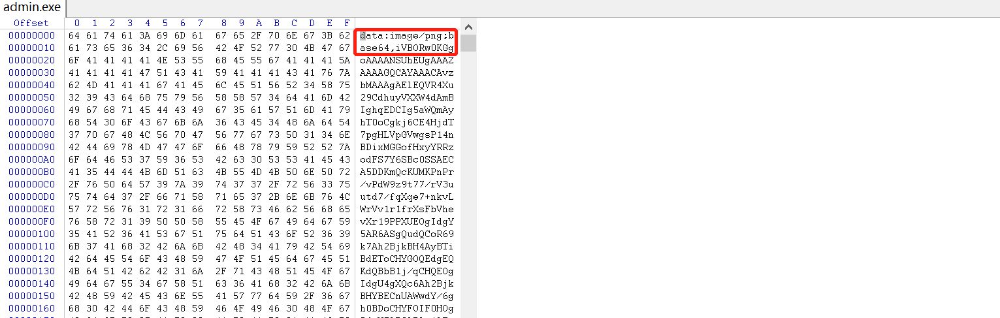

## Admin

### 0x00 分析程序

运行程序 , 发现程序并不是 `.exe` , 使用 `Winhex` 打开：



`base64` 编码后的 `png` 图片 ( 看来是一道隐写题...)

### 0x01 获取图片

`python` 脚本提取图片：

```python
import base64
p = 'iVBORw0KGgoAAAANSUhEUgAAAZAAAAGQCAYA...........'
with open('res.png','ab') as f:
    f.write(base64.b64decode(p))
```

打开 `res.png`：


扫码拿到 `flag`。


### 总结

- 这是一道隐写题......


