# ConsoleApplication4

## 0x00 尝试运行

运行 `.exe` 文件：

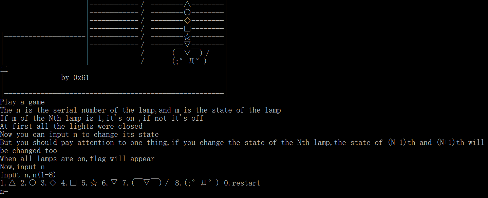

可以看到这道题的题目要求：

```
Play a game
The n is the serial number of the lamp,and m is the state of the lamp
If m of the Nth lamp is 1,it's on ,if not it's off
At first all the lights were closed
Now you can input n to change its state
But you should pay attention to one thing,if you change the state of the Nth lamp,the state of (N-1)th and (N+1)th will be changed too
```

作为一个硬核玩家, 首先直接尝试能不能直接解题。首先尝试点燃第 1 盏灯：

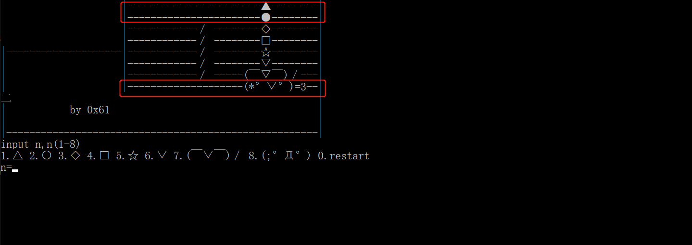

发现第 1,2,8 三盏灯同时亮了, `i.e.` 这 8 盏灯其实组成了一个循环的圆：

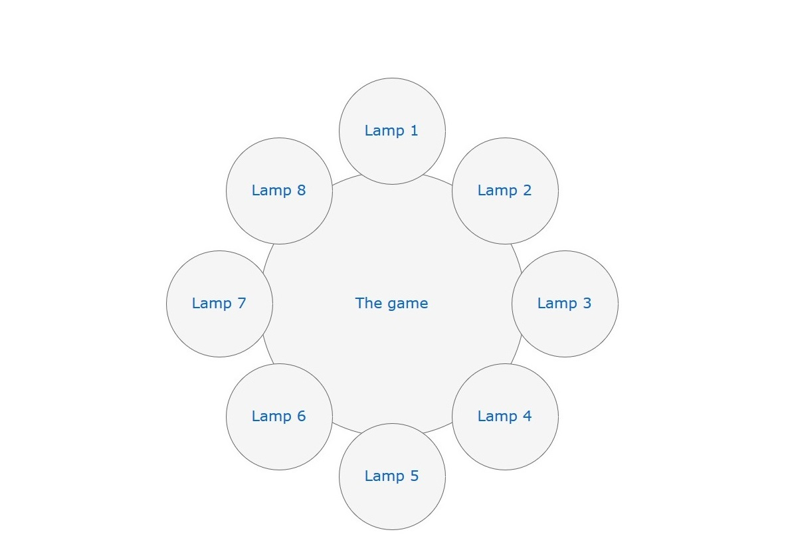

输入一个 n , 考虑所有可能出现的情况：

1. 点燃 3 盏灯 

2. 点燃 1 盏灯

3. 熄灭 1 盏灯

4. 熄灭 3 盏灯

显然, 存在组合能够点燃所有的灯 ( 3 * 2 + 1 * 2、3 * 3 - 1 * 1 等等 )。这里尝试 `2 ( 点燃 1 盏灯 ) => 2 ( 点燃 1 盏灯 ) => 1 ( 点燃 3 盏灯 ) => 1 ( 点燃 3 盏灯 ) `。

- 点燃  n = 1 ：依次输入 `1` => `3` => `4` => `7` => `6` （此时已点燃 `lamp 1`）
- 点燃  n = 5 ：依次输入 5 => 7 => 8 => 3 => 2 （此时已点燃 `lamp 1,5`）
- 点燃 n = 2 , 3 , 4：输入 3 （此时已点燃 `lamp 1,2,3,4,5`）
- 点燃 n = 6 , 7 , 8：输入 7  （此时已点燃 `lamp 1,2,3,4,5,6,7,8`）

拿到 `flag` :

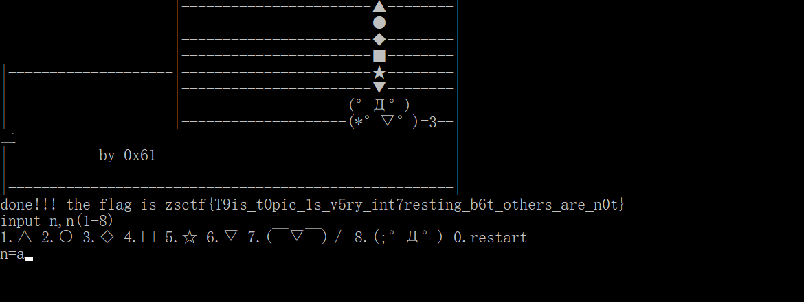

当然 , 也有其他的方法：依次输入 `1 => 2 => 3 => 4 => 5=> 6 => 7=> 8` ( `+3 => -1 => +1 => +1 => +1 => +1 => -1 => +3 ` )  等。


0x01 逆向分析

`PEiD`  查壳：

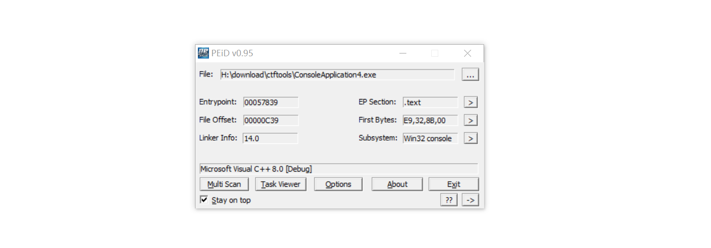

`IDA` 打开程序 , `Shift + F12` 查看字符串 , 发现没有 flag。 `ALT + T` 直接搜索 `ctf` 同样无果。

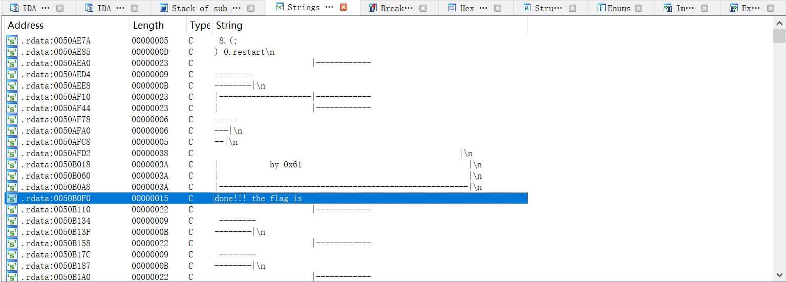

但是可以通过找到哪些函数使用 `done!!! the ......` 这个字符串 , 从而获得 `flag` 的内存地址 , 直接进行查看。

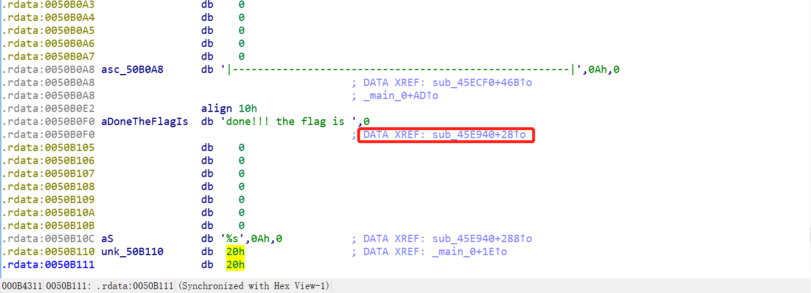

可以看到交叉引用的地址 , 直接双击：

 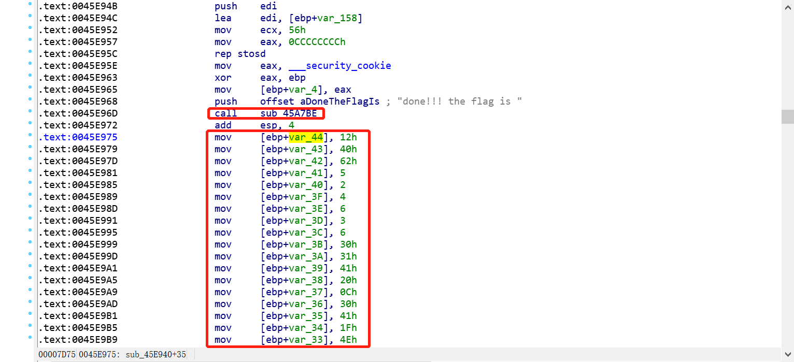

`[ebp + var_xx]` 中存在不可打印字符 , 显然不是 `flag`。因此 , 直接进入 `sub_45A7BE ` , 发现主要的作用是 `rep stosd` 清空某些内存地址。因此查看数组之后的汇编指令：

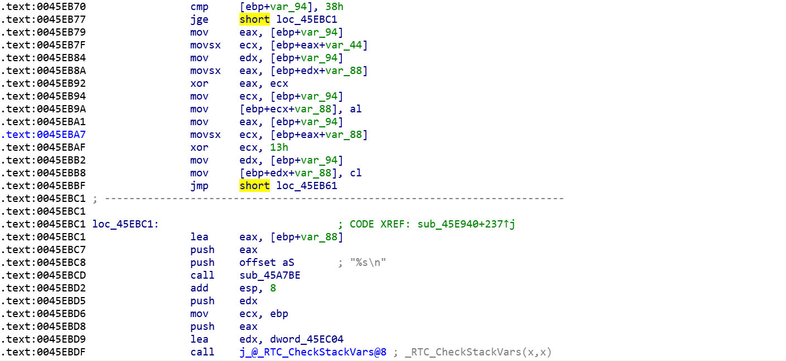

`IDA F5` 查看源码：

```c
 sub_45A7BE("done!!! the flag is ");
  v59 = 18;
  v60 = 64;
  v61 = 98;
  v62 = 5;
  v63 = 2;
  v64 = 4;
  v65 = 6;
  v66 = 3;
  v67 = 6;
  v68 = 48;
  v69 = 49;
  v70 = 65;
  v71 = 32;
  v72 = 12;
  v73 = 48;
  v74 = 65;
  v75 = 31;
  v76 = 78;
  v77 = 62;
  v78 = 32;
  v79 = 49;
  v80 = 32;
  v81 = 1;
  v82 = 57;
  v83 = 96;
  v84 = 3;
  v85 = 21;
  v86 = 9;
  v87 = 4;
  v88 = 62;
  v89 = 3;
  v90 = 5;
  v91 = 4;
  v92 = 1;
  v93 = 2;
  v94 = 3;
  v95 = 44;
  v96 = 65;
  v97 = 78;
  v98 = 32;
  v99 = 16;
  v100 = 97;
  v101 = 54;
  v102 = 16;
  v103 = 44;
  v104 = 52;
  v105 = 32;
  v106 = 64;
  v107 = 89;
  v108 = 45;
  v109 = 32;
  v110 = 65;
  v111 = 15;
  v112 = 34;
  v113 = 18;
  v114 = 16;
  v115 = 0;
  v2 = 123;
  v3 = 32;
  v4 = 18;
  v5 = 98;
  v6 = 119;
  v7 = 108;
  v8 = 65;
  v9 = 41;
  v10 = 124;
  v11 = 80;
  v12 = 125;
  v13 = 38;
  v14 = 124;
  v15 = 111;
  v16 = 74;
  v17 = 49;
  v18 = 83;
  v19 = 108;
  v20 = 94;
  v21 = 108;
  v22 = 84;
  v23 = 6;
  v24 = 96;
  v25 = 83;
  v26 = 44;
  v27 = 121;
  v28 = 104;
  v29 = 110;
  v30 = 32;
  v31 = 95;
  v32 = 117;
  v33 = 101;
  v34 = 99;
  v35 = 123;
  v36 = 127;
  v37 = 119;
  v38 = 96;
  v39 = 48;
  v40 = 107;
  v41 = 71;
  v42 = 92;
  v43 = 29;
  v44 = 81;
  v45 = 107;
  v46 = 90;
  v47 = 85;
  v48 = 64;
  v49 = 12;
  v50 = 43;
  v51 = 76;
  v52 = 86;
  v53 = 13;
  v54 = 114;
  v55 = 1;
  v56 = 117;
  v57 = 126;
  v58 = 0;
  for ( i = 0; i < 56; ++i )
  {
    *(&v2 + i) ^= *(&v59 + i);
    *(&v2 + i) ^= 0x13u;
  }
  return sub_45A7BE("%s\n");
```

`sub_45A7BE` 在开头被调用 , 最后也被调用 , 显然是打印语句之类的 , 而 `flag` 就是在中间的 `for` 循环中 , 编写 `python` 脚本：

```python
v59 = 18;v60 = 64;v61 = 98;v62 = 5;v63 = 2;v64 = 4;v65 = 6;v66 = 3;v67 = 6;v68 = 48;v69 = 49;v70 = 65;v71 = 32;v72 = 12;v73 = 48;v74 = 65;v75 = 31;v76 = 78;v77 = 62;v78 = 32;v79 = 49;v80 = 32;v81 = 1;v82 = 57;v83 = 96;v84 = 3;v85 = 21;v86 = 9;v87 = 4;v88 = 62;v89 = 3;v90 = 5;v91 = 4;v92 = 1;v93 = 2;v94 = 3;v95 = 44;v96 = 65;v97 = 78;v98 = 32;v99 = 16;v100 = 97;v101 = 54;v102 = 16;v103 = 44;v104 = 52;v105 = 32;v106 = 64;v107 = 89;v108 = 45;v109 = 32;v110 = 65;v111 = 15;v112 = 34;v113 = 18;v114 = 16;v115 = 0;v2 = 123;v3 = 32;v4 = 18;v5 = 98;v6 = 119;v7 = 108;v8 = 65;v9 = 41;v10 = 124;v11 = 80;v12 = 125;v13 = 38;v14 = 124;v15 = 111;v16 = 74;v17 = 49;v18 = 83;v19 = 108;v20 = 94;v21 = 108;v22 = 84;v23 = 6;v24 = 96;v25 = 83;v26 = 44;v27 = 121;v28 = 104;v29 = 110;v30 = 32;v31 = 95;v32 = 117;v33 = 101;v34 = 99;v35 = 123;v36 = 127;v37 = 119;v38 = 96;v39 = 48;v40 = 107;v41 = 71;v42 = 92;v43 = 29;v44 = 81;v45 = 107;v46 = 90;v47 = 85;v48 = 64;v49 = 12;v50 = 43;v51 = 76;v52 = 86;v53 = 13;v54 = 114;v55 = 1;v56 = 117;v57 = 126;v58 = 0;
base = 'v'
ret = ''
for i in range(56):
    o = locals()[base + str(i + 2)] ^ locals()[base + str(i + 59)] ^ 0x13
    c = chr(o)
    ret += c
print(ret)
```

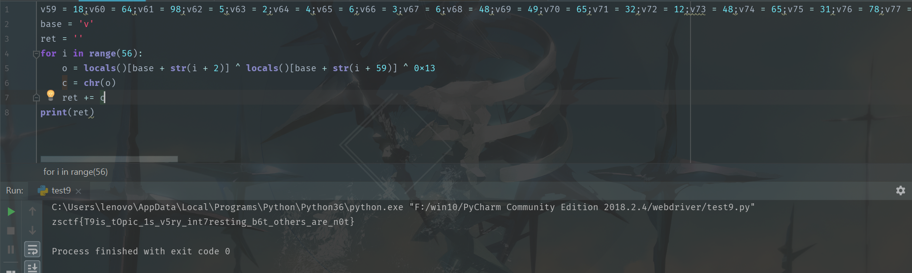

即可拿到 `flag` 。


## 0x02 跳转逻辑

用 `OD` 可以修改跳转逻辑，尝试在多个跳转点修改 `jmp` 地址 , 即可拿到 `flag` :

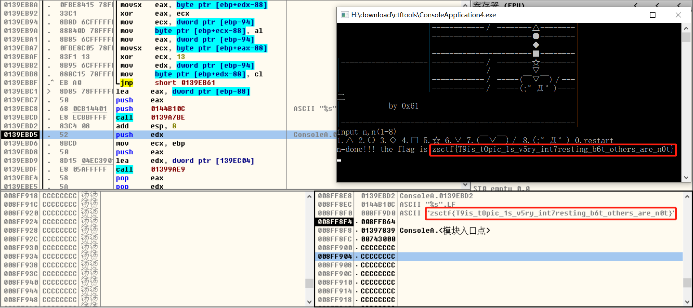


## 0x03 总结

做这道题使用以下的方法：

- 强解
- 字符串搜索
- 修改跳转逻辑字符串搜索
- 静态分析


