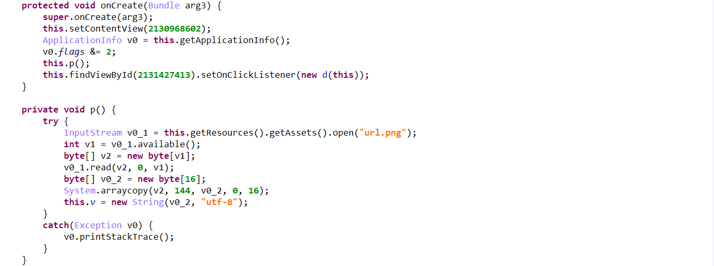
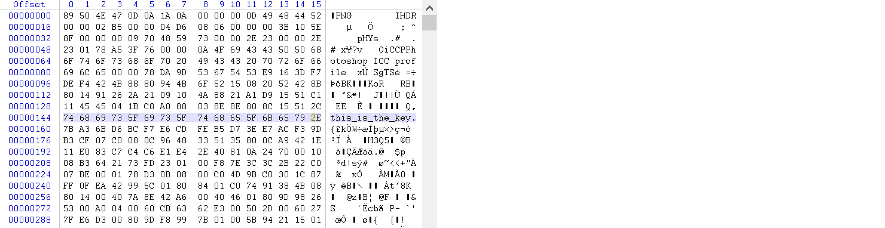
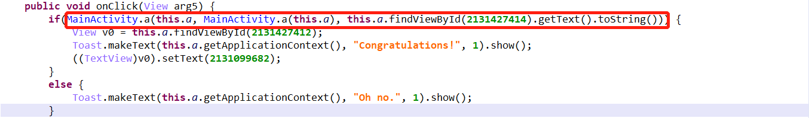
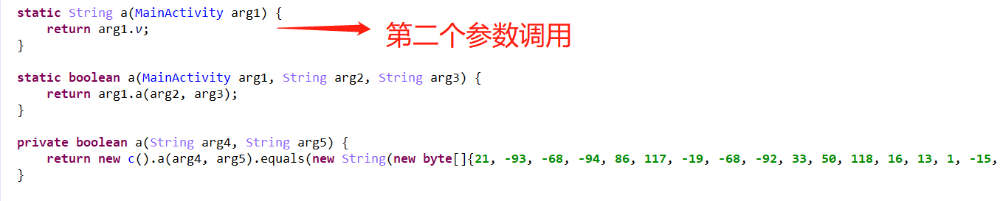
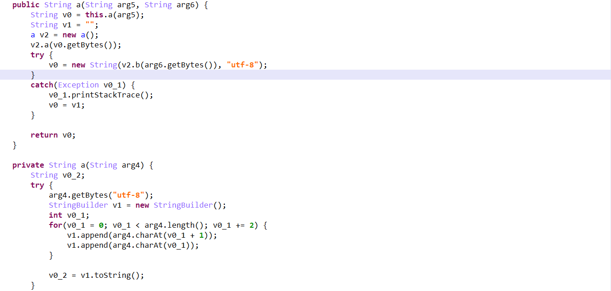
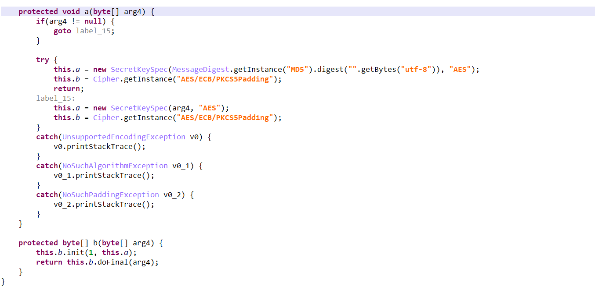

## Easy_100

### 0x00 运行程序

`adb` 将程序传输到手机上运行：


大概思路：提交正确的 `input` 返回是否正确。


### 0x01 逆向分析

`Jeb` 打开文件,  因为程序使用了 `ProGuard`  混淆 , 不同的类中重复的方法名相同 , 相同类中重载的使用  , 导致代码分析及其不方便 , 因此下面给出主要分析的代码：



`MainActivity` 的 `onCreate` 方法调用了 `p` 方法 , `p` 方法的主要功能是从图片文件 `url.png` 中读取加密密钥 , 具体是从图片的 144 字节处读取 16 byte , 可以用 `WinHex` 简单查看一下密钥：



密钥被存在该类的 `p` 变量里。之后查看 `d`  类的 `onClick` 方法：



调用了 `MainActivity` 的 静态 `a` 方法 (3 args) , 第二个参数调用了静态 `a` 方法 (1 args) 获取了密钥 ; 而第三个参数是输入 ：



之后将 `key` 和 `input` 作为参数调用 `MainActivity` 的 `a` 方法 (2 args) , 其中定义一个 `c` 类对象并调用其 `a` 方法 , 查看 `c().a(xxx,xxx)` ：



第一个参数 `key` 经过了 `c().a(xxx)` 处理 , 储存方式发生变化 (奇偶字节互换) , 变为 `htsii__sht_eek.y` 。第二个参数 `input` 作为 `a().a(xxx)` 的参数 , 查看 `a().a(xxx)`：



`input` 经过 `ECB` 工作模式、`PKCS5` 填充、`AES` 加密 , 密钥为之前变化过的 `key` , 与密文的比较 , 如果输入正确 , 则打印 `Conxxx!` ; 显然输入应该就是 `flag`。


### 0x02 解密

密文、密钥、加密方法等信息均已知 , 因此可以直接用 `Java` 写出解密脚本 ( 之前 `python` 写的没跑出来... )：

```java
package test1;

import java.io.UnsupportedEncodingException;
import java.security.InvalidKeyException;
import java.security.MessageDigest;
import java.security.NoSuchAlgorithmException;

import javax.crypto.BadPaddingException;
import javax.crypto.Cipher;
import javax.crypto.IllegalBlockSizeException;
import javax.crypto.NoSuchPaddingException;
import javax.crypto.spec.SecretKeySpec;

public class Main {
	public static void main(String[] args) throws NoSuchAlgorithmException, NoSuchPaddingException, InvalidKeyException, UnsupportedEncodingException, IllegalBlockSizeException, BadPaddingException {
		SecretKeySpec a;
		Cipher b;
		byte [] c;
		
		a = new SecretKeySpec("htsii__sht_eek.y".getBytes(), "AES");
		b = Cipher.getInstance("AES/ECB/PKCS5Padding");
	    b.init(Cipher.DECRYPT_MODE, a);
	    c = new byte[]{21, -93, -68, -94, 86, 117, -19, -68,
	    		-92, 33, 50, 118, 16, 13, 1, -15, -13, 3, 4, 103, -18, 81,
	    		30, 68, 54, -93, 44, -23, 93, 98, 5, 59};
	    String p = new String(b.doFinal(c),"utf-8");
	    System.out.println(p);
	}   
}
```

拿到 `flag`：

.jpg)

### 0x03 总结

​	终于理解了为什么 `IDA` 要有函数流程图的功能 ......


### 参阅

- [ProGuard代码混淆技术详解](https://www.cnblogs.com/cr330326/p/5534915.html)
