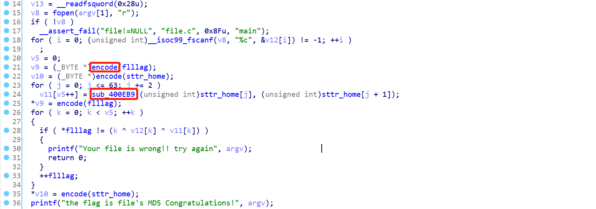

## File

### 0x00 分析文件

下载 `file.zip` 压缩包并解压 , 得到名为 `file` 的无后缀文件 , 猜想为 `elf` 文件。`Kali` 使用 `file` 查看文件类型：

```
file ./file
```


为 64 位的 ELF 文件。


### 0x01 逆向分析

`IDA` 分析：



发现源码中有 2 个关键函数 [encode]、[sub_400EB9],及 2 个关键变量 [sttr_home]、[flllag] , 查看关键变量：

```
flllag : flag{hello_player_come_on_hahah}
sttr_home : 664e06226625425d562e766e042d422c072c45692d125c7e6552606954646643
```

查看关键函数 [encode]：

```c
v17 = 0;
  v1 = strdup(a1);
  v21 = v1;
  v2 = strlen(v1);
  v19 = v2 / 3;
  v20 = v2 % 3;
  v3 = 4 * (v2 / 3);
  if ( v20 )
    v4 = 4;
  else
    v4 = 0;
  v5 = v4 + v3;
  v22 = malloc(v4 + v3 + 1);
  bzero(v22, v5 + 1);
  for ( i = 0; 3 * v19 > i; i += 3 )
  {
    v6 = v17;
    v7 = v17 + 1;
    *((_BYTE *)v22 + v6) = b64_to_ascii((unsigned int)(char)((signed int)(unsigned __int8)v21[i] >> 2));
    v8 = v7++;
    *((_BYTE *)v22 + v8) = b64_to_ascii((unsigned int)(char)(16 * (v21[i] & 3) | ((signed int)(unsigned __int8)v21[i + 1] >> 4)));
    *((_BYTE *)v22 + v7) = b64_to_ascii((unsigned int)(char)(4 * (v21[i + 1] & 0xF) | ((signed int)(unsigned __int8)v21[i + 2] >> 6)));
    v9 = v7 + 1;
    v17 = v7 + 2;
    *((_BYTE *)v22 + v9) = b64_to_ascii(v21[i + 2] & 0x3F);
  }
  if ( v20 == 1 )
  {
    v10 = v17;
    v11 = v17 + 1;
    *((_BYTE *)v22 + v10) = b64_to_ascii((unsigned int)(char)((signed int)(unsigned __int8)v21[i] >> 2));
    v12 = v11++;
    *((_BYTE *)v22 + v12) = b64_to_ascii((unsigned int)(char)(16 * (v21[i] & 3)));
    *((_BYTE *)v22 + v11) = 61;
    *((_BYTE *)v22 + v11 + 1) = 61;
  }
  else if ( v20 == 2 )
  {
    v13 = v17;
    v14 = v17 + 1;
    *((_BYTE *)v22 + v13) = b64_to_ascii((unsigned int)(char)((signed int)(unsigned __int8)v21[i] >> 2));
    v15 = v14++;
    *((_BYTE *)v22 + v15) = b64_to_ascii((unsigned int)(char)(16 * (v21[i] & 3) | ((signed int)(unsigned __int8)v21[i + 1] >> 4)));
    *((_BYTE *)v22 + v14) = b64_to_ascii((unsigned int)(char)(4 * (v21[i + 1] & 0xF)));
    *((_BYTE *)v22 + v14 + 1) = 61;
  }
  if ( v21 )
    free(v21);
```

简单的看一下就是 `base64` 编码。

查看关键函数 [sub_400EB9]：

```
__int64 __fastcall sub_400EB9(char a1, char a2)
{
  int v2; // ebx

  v2 = 16 * (unsigned __int64)sub_400E6A((unsigned int)a1);
  return v2 + (unsigned int)sub_400E6A((unsigned int)a2);
}
```

一个字符串的映射函数 。

因此根据主函数的逻辑可以写出 `python` 脚本：

```python
import hashlib
def index(c):
    return '0123456789abcde'.find(c)

f = 'flag{hello_player_come_on_hahah}'
h = '664e06226625425d562e766e042d422c072c45692d125c7e6552606954646643'

ret = []
for i in range(32):
    high = index(h[2 * i]) *16
    low = index(h[2 * i + 1])
    ret.append(high + low)

s = ''
for i in range(32):
    s += chr(i ^ ret[i] ^ ord(f[i]))
print(s.encode('utf-8'))
flag = hashlib.md5(s.encode('utf-8')).hexdigest()
print('flag{' + flag + '}')
```

主函数中有一个输入文件的验证功能, 将输出的中间结果写入文件 (中间结果：\x00#eF\x19H!62H#\x15dA5Feb4\x15Tb\x15\x06\x13\x14\x12\x13 \x18\x10!) ：

```perl
perl -e 'print "\x00#eF\x19H!62H#\x15dA5Feb4\x15Tb\x15\x06\x13\x14\x12\x13 \x18\x10!"' > 1

# 验证中间文件
./file 1
```


计算 `md5` 值 , 即可拿到 `flag`

 