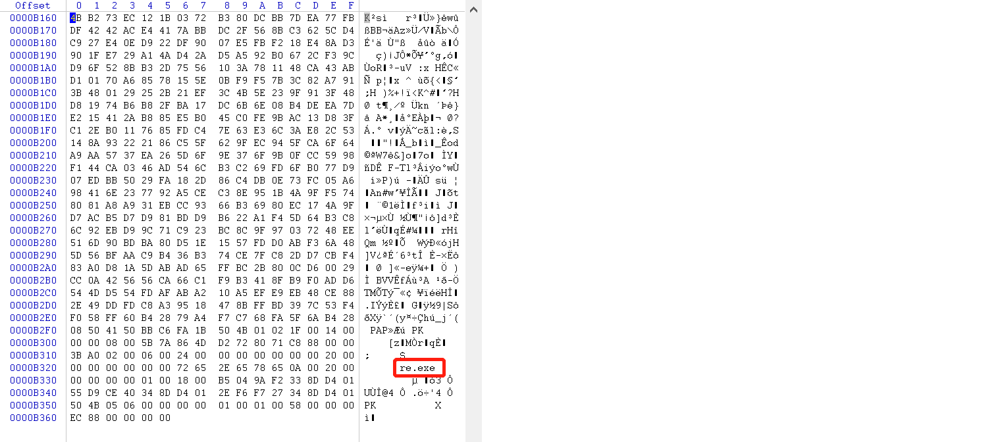
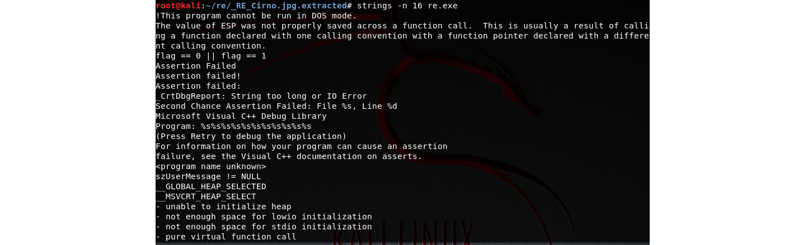
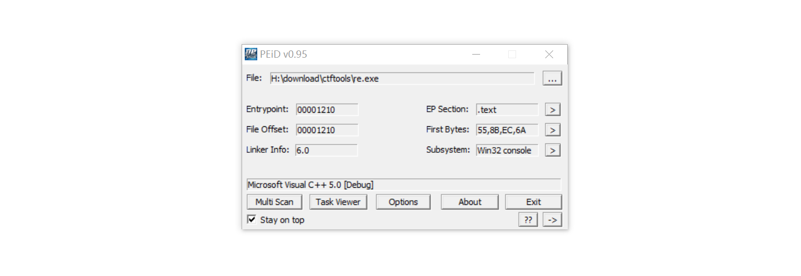
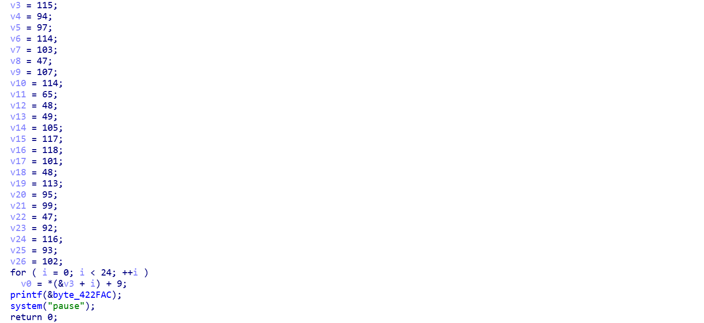
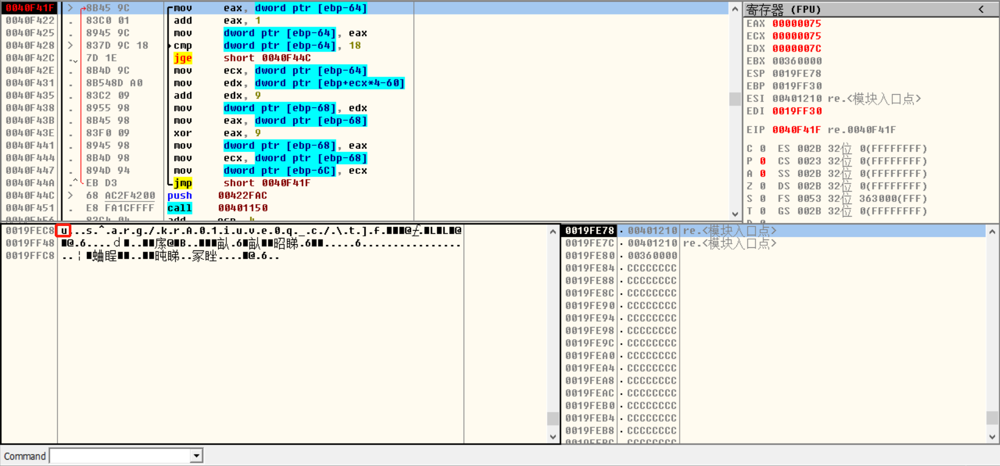

## RE_Cirno

### 0x00 分离文件

下载附件 , 发现是一张 `.jfif` 的图片,  `Winhex`  打开：



使用 `binwalk` 分离文件 , 得到 `re.exe` 文件：


使用 `strings` 直接搜索明文：

```bash
strings -n 16 re.exe
```



没有 `flag` 相关信息。


### 0x01 逆向分析

`PEiD` 查壳：



`IDA` 查看源码：



发现源码很简单 , 直接把数组中每个元素的 `ascii` 加 9,  然后转字符串。`python` 脚本如下：

```python
v3 = 115;v4 = 94;v5 = 97;v6 = 114;v7 = 103;v8 = 47;v9 = 107;v10 = 114;v11 = 65;v12 = 48;v13 = 49;v14 = 105;v15 = 117;v16 = 118;v17 = 101;v18 = 48;v19 = 113;v20 = 95;v21 = 99;v22 = 47;v23 = 92;v24 = 116;v25 = 93;v26 = 102;
base = 'v'
ret = ''
for i in range(24):
    o = chr(locals()[base + str(i + 3)])
    ret += o
print(ret)
```

结果为一串乱码...... 运行程序 , 发现有一些提示信息：


很明显是逆序、栅栏长度为 9 的栅栏密码 。对之前的乱码进行上述操作 , 结果依然是乱码......

 简单分析了一下 `IDA` 的源码 , 可能是 `*(&v3 + i)` 并没有遍历 `v3~v26` , 因此决定直接打开 `OD` 动态调试:



 定位到上图主要函数区域 , 发现是一个循环 , 每次将 `flag` 中的 1 byte 计算出来并放入 `ebp - 0x68` 处。因此 , 只需要记录 `ebp - 0x68` 的字符串即可。

记录完成后 , 得到以下的字符串 , 逆序加 9 层栅栏解密 ：

```
uncry1}rC03{wvg0sae1ltof => fotl1eas0gvw{30Cr}1yrcnu => 

fot
l1e
as0
gvw
{30
Cr}
1y
rc
nu
```

得到 `flag`。


### 总结

- 这是一道隐写题...
- 因为循环每次是对 `flag` 中的一个字符进行处理并存放在同一位置 , 所以 `flag` 并完整的存放在内存中 。但是如果能找到内存中的位置并定位分析 , 很容易就可以拿到 `flag` 


