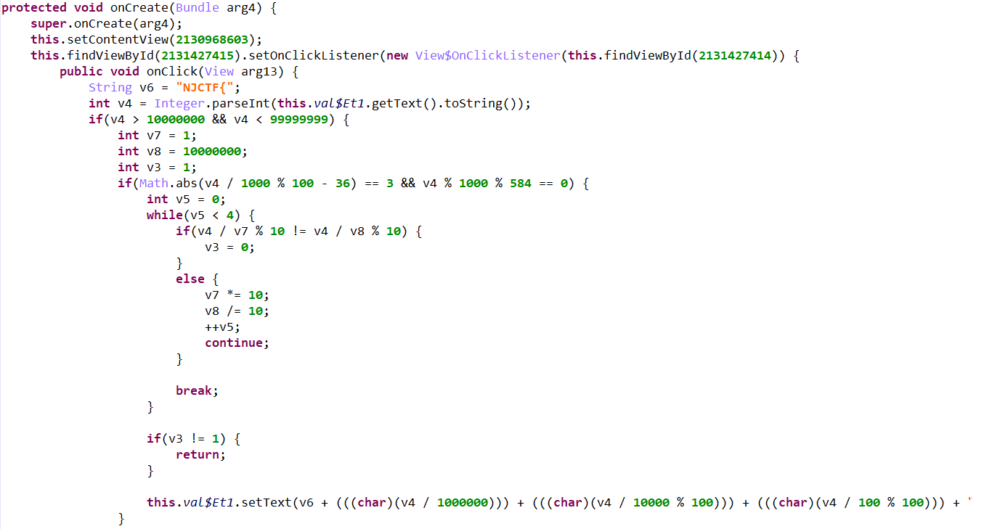
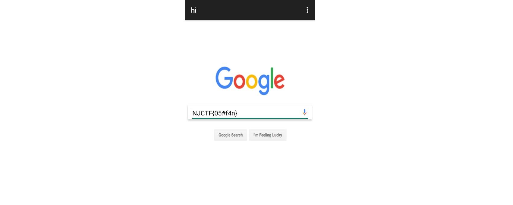
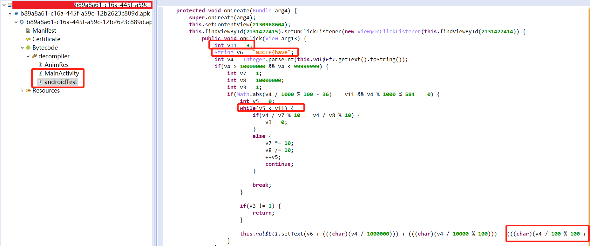
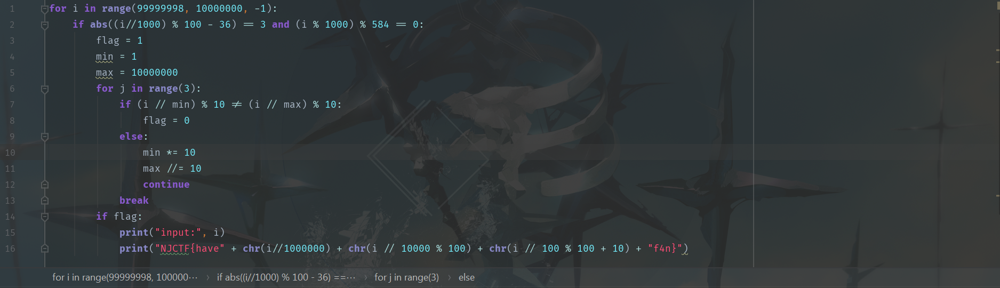
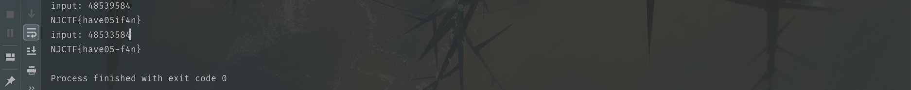

## SafeBox

### 0x00 运行程序

`adb` 传输到手机上 , 打开 `apk` 文件：


背景图是贴上去的 ( 光标还在上面...)  , 思路大概就是输入正确的值 , 会返回 `flag`。


### 0x01 逆向分析

`Jeb` 打开文件：



简单看一下 , `v4` 需要满足要求：

- 8 位回文数
- 中间两位 ( 4,5 位 ) 为 33 (39 不是回文)
- 最后三位为 584

因此根据上述条件 , 可以直接写出该数：48533584。放入输入框中上验证 , 返回结果如下：



提交发现结果错误 ...... 看到题目要求：

```
 flag格式 NJCTF{xxx} 并且 xxx 只包含[a-z][A-Z][0-9]
```

陷入沉思...... 后来发现 `Bytecode` 下还有一个 `androidTest` 的文件 , 里面还有一个 `onClick` 函数 , 看一下逻辑：



`v4` 的回文要求变为 1,2,3 和 6,7,8 位 , 中间 5,6 位可以是 33 或在 39 , 33 之前使用过 , 因此最后的 `input` 应该为  48539584。按照逻辑写出代码 , 即可拿到 `flag`。


### 0x02 爆破

也可以不进行逻辑分析 , 直接 `python` 脚本爆破：  

```python
for i in range(99999998, 10000000, -1):
    if abs((i//1000) % 100 - 36) == 3 and (i % 1000) % 584 == 0:
        flag = 1
        min = 1
        max = 10000000
        for j in range(3):
            if (i // min) % 10 != (i // max) % 10:
                flag = 0
            else:
                min *= 10
                max //= 10
                continue
            break
        if flag:
            print("input:", i)
            print("NJCTF{have" + chr(i//1000000) + chr(i // 10000 % 100) + chr(i // 100 % 100 + 10) + "f4n}")
```

得到 `flag`：



