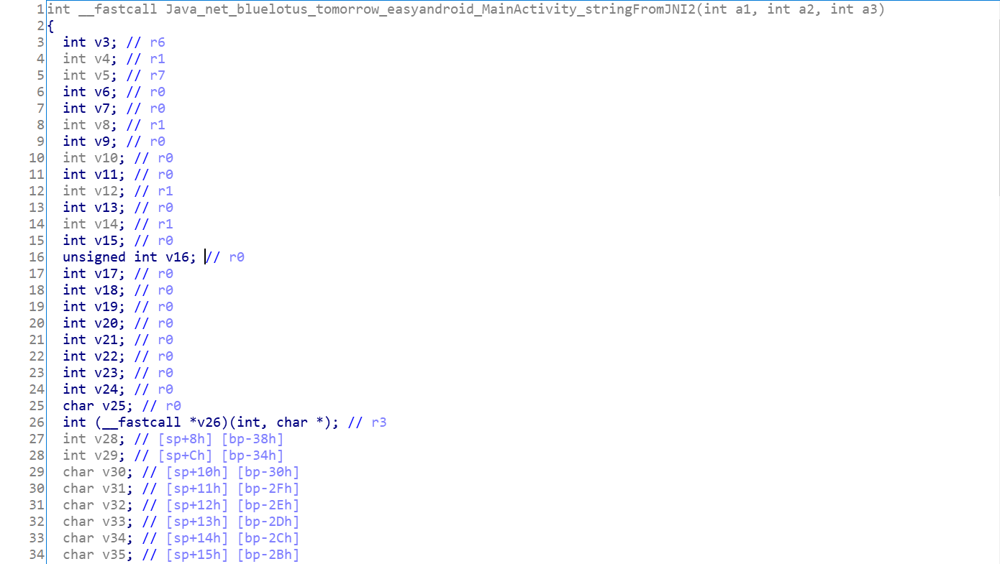
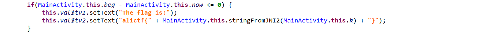
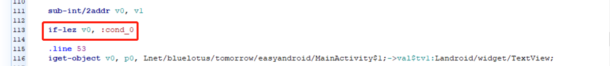
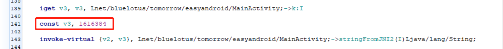
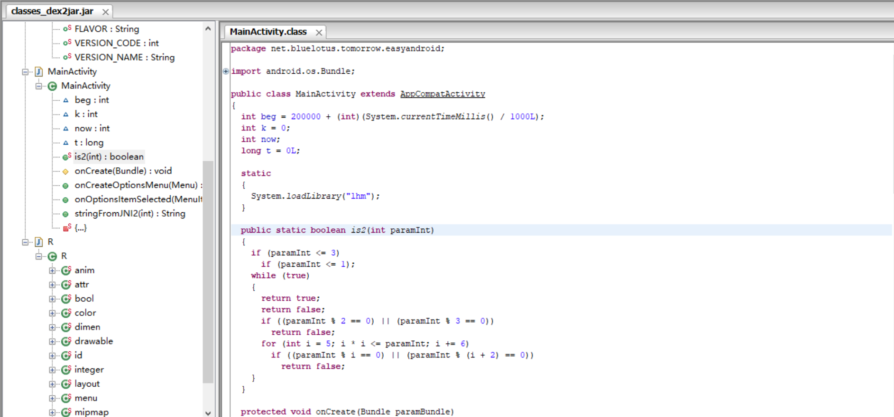

## Timer

### 0x00 查看文件

发现文件是一个 `.apk` 的文件 , 本来打算在 `Android Studio` 上开一个虚拟设备 , 再将 `.apk` 安装到虚拟设备上打开 , 结果总是有一些莫名其妙的报错信息 , 因此直接安装到真机上进行查看：


发现是一个 20 万秒的计时器 , 读完秒之后即可显示 `flag`。


### 0x01 工具分析

使用 `jeb` 打开文件, 反编译 `dex` 文件：

```java
public class MainActivity extends AppCompatActivity {
    int beg;
    int k;
    int now;
    long t;

    static {
        System.loadLibrary("lhm");
    }

    public MainActivity() {
        super();
        this.beg = (((int)(System.currentTimeMillis() / 1000))) + 200000;
        this.k = 0;
        this.t = 0;
    }

    public static boolean is2(int arg4) {
        boolean v1 = true;
        if(arg4 > 3) {
            if(arg4 % 2 != 0 && arg4 % 3 != 0) {
                int v0 = 5;
                while(true) {
                    if(v0 * v0 <= arg4) {
                        if(arg4 % v0 != 0 && arg4 % (v0 + 2) != 0) {
                            v0 += 6;
                            continue;
                        }
                        return false;
                    }
                    else {
                        return v1;
                    }
                }
                return false;
            }
            v1 = false;
        }
        else if(arg4 <= 1) {
            v1 = false;
        }
        return v1;
    }

    protected void onCreate(Bundle arg7) {
        super.onCreate(arg7);
        this.setContentView(2130968600);
        View v2 = this.findViewById(2131492944);
        View v3 = this.findViewById(2131492945);
        Handler v0 = new Handler();
        v0.postDelayed(new Runnable(((TextView)v3), ((TextView)v2), v0) {
            public void run() {
                MainActivity.this.t = System.currentTimeMillis();
                MainActivity.this.now = ((int)(MainActivity.this.t / 1000));
                MainActivity.this.t = 1500 - MainActivity.this.t % 1000;
                this.val$tv2.setText("AliCTF");
                if(MainActivity.this.beg - MainActivity.this.now <= 0) {
                    this.val$tv1.setText("The flag is:");
                    this.val$tv2.setText("alictf{" + MainActivity.this.stringFromJNI2(MainActivity.this.k) + "}");
                }

                if(MainActivity.is2(MainActivity.this.beg - MainActivity.this.now)) {
                    MainActivity.this.k += 100;
                }
                else {
                    --MainActivity.this.k;
                }

                this.val$tv1.setText("Time Remaining(s):" + (MainActivity.this.beg - MainActivity.this.now));
                this.val$handler.postDelayed(((Runnable)this), MainActivity.this.t);
            }
        }, 0);
    }
```

主要分析点：

- 载入 1hm 的 so 库：

  ```java
  	System.loadLibrary("lhm");   
  ```

- run 的执行间隔时间的计算：

  ```java
      MainActivity.this.t = 1500 - MainActivity.this.t % 1000;
  ```

  `MainActivity.this.t % 1000` 是一个分布区间在 [0 , 1000] 的平均分布 ; 因此 , 间隔时间就是一个 [500, 1500] 的平均分布 , 平均 1 s (也就是个秒表)。 

- stringFromJNI2 分析：

  ```
  	this.val$tv2.setText("alictf{" + MainActivity.this.stringFromJNI2(MainActivity.this.k) + "}");
  ```

  向后翻页可以看到 stringFromJNI2是一个 native 方法：

  ```java
  public native String stringFromJNI2(int arg1) {
  }
  ```
  可以在 `.so` 文件中查找函数 ,  `.so` 文件相当于 `Windows` 下的 `dll` 文件 , 可以直接使用 `IDA` 进行分析：

  

  发现函数太过于复杂 , 决定直接计算出 `k`  值 ( 因为 k 值是通过一个平均值计算出的 , 所以之前担心分析 k 会不会出错 , 后来证明我多虑了...)

### 0x02 计算 k 值

用 `Java` 写出 k 值的计算方法：

```java
public class Main {
 
    public static boolean is2(int n) {
        boolean v1 = true;
        if(n > 3) {
            if(n % 2 != 0 && n % 3 != 0) {
                int v0 = 5;
                while(true) {
                    if(v0 * v0 <= n) {
                        if(n % v0 != 0 && n % (v0 + 2) != 0) { v0 += 6; continue; }
                        return false;
                    }
                    else { return v1; }
                }
            }
            v1 = false;
        }
        else if(n <= 1) { v1 = false; }
        return v1;
    }
 
    public static void main(String args[]) {
        int time = 200000;
        int k = 0;
        while (time > 0) {
            if (is2(time)) { k += 100;}
            else { k--; }
            time--;
        }
        System.out.println(k);
    }
}
```

得到 k 的值为 `1616384` 。


### 0x03 修改程序逻辑

主要需要修改两点：

-  k 值
- 跳转逻辑 , 直接打印 CTF

要修改的函数如下：



修改后源码大概这样：

```
if(MainActivity.this.beg - MainActivity.this.now > 0) {
                    MainActivity.this.k = 1616384;
                    this.val$tv1.setText("The flag is:");
                    this.val$tv2.setText("alictf{" + MainActivity.this.stringFromJNI2(MainActivity.this.k) + "}");
                }
```

使用 `Android killer` 修改对应的 `smail` 代码：





直接使用自带的 `编译` 功能 , 得到签名后的 `.apk` 文件 , 安装到真机打开, 即可拿到 `flag`。

 

### 0x04 总结

第一次做 `Android` 逆向题 , 也参照了其他人的 `writeup` , 同时学会了很多工具。比如之前查看 `java` 源码的流程是通过 `dex2jar` => `jd-gui` 来进行查看 , 效果大概是这个样子：



但是 `jeb` 实在是太方便了！(虽然搭环境搭了半天...)

`Android killer` 也整合了 `apktool`反编译 `apk` => `smail` 、  `keytool` 生成密钥 => `jarsigner`签名的功能。

`Android studio` 的 `showbytes` 不知道为什么用不了 , 模拟器也装不上 `apk` ...


### 参阅

- [Android反编译技术总结](<https://unclechen.github.io/2016/09/07/Android%E5%8F%8D%E7%BC%96%E8%AF%91%E6%8A%80%E6%9C%AF%E6%80%BB%E7%BB%93/>)

- [浅析 Android 打包流程](<https://mp.weixin.qq.com/s?__biz=MzI0NjIzNDkwOA==&mid=2247483789&idx=1&sn=6aed8c7907d5bd9c8a5e7f2c2dcdac2e&scene=1&srcid=0831CCuRJsbJNuz1WxU6uUsI#wechat_redirect>)

  